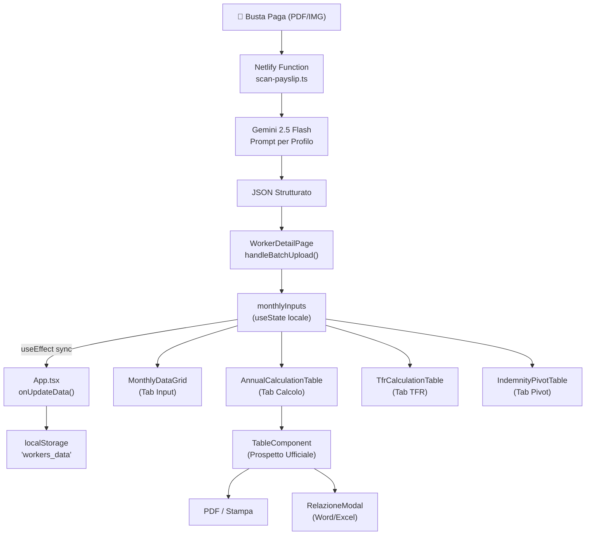
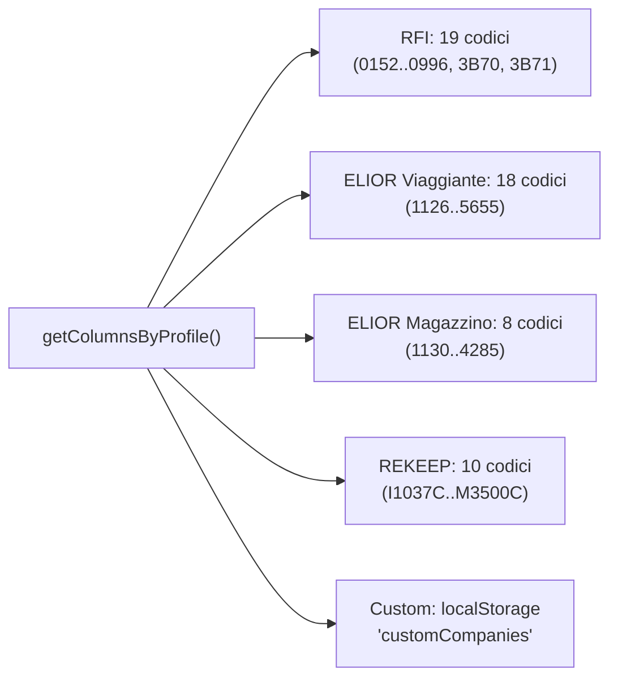

# 🏗️ RailFlow — Project Health & Architecture Report

> **Data:** 30 Aprile 2026 · **Versione Analizzata:** Production (Netlify) · **Autore:** Antigravity AI Auditor

---

## 1. Architettura e Flusso Dati

### 1.1 Stack Tecnologico

| Layer | Tecnologia | Versione |
|---|---|---|
| **Runtime** | React | 19.2.3 |
| **Build** | Vite | 6.2.0 |
| **Styling** | Tailwind CSS v4 | 4.1.18 |
| **Animazioni** | Framer Motion | 12.29.0 |
| **Backend (Serverless)** | Netlify Functions | 5.1.2 |
| **AI Engine** | Google Generative AI (Gemini 2.5 Flash) | 0.24.1 |
| **Realtime DB** | Supabase (QR Mobile Sync) | 2.96.0 |
| **Export PDF** | jsPDF + AutoTable | 4.0.0 / 5.0.7 |
| **Export Excel** | ExcelJS | 4.4.0 |
| **OCR (Locale)** | Tesseract.js | 7.0.0 |

### 1.2 Mappa dei Componenti (Top 10 per dimensione)

| File | Linee | Ruolo |
|---|---|---|
| [WorkerDetailPage.tsx](file:///c:/Users/Franc/OneDrive/Desktop/google%20studio%20ferie/components/WorkerDetailPage.tsx) | **3359** | Hub centrale lavoratore: upload, OCR, split-view, AI explainer |
| [App.tsx](file:///c:/Users/Franc/OneDrive/Desktop/google%20studio%20ferie/App.tsx) | **1973** | Gestione stato globale, routing, CRUD, dashboard |
| [MonthlyDataGrid.tsx](file:///c:/Users/Franc/OneDrive/Desktop/google%20studio%20ferie/components/WorkerTables/MonthlyDataGrid.tsx) | **1606** | Griglia mensile editabile (drag-to-fill, undo, context menu) |
| [DynamicIsland.tsx](file:///c:/Users/Franc/OneDrive/Desktop/google%20studio%20ferie/components/DynamicIsland.tsx) | **1244** | HUD globale: calcolatrice, AI chat, upload progress |
| [TableComponent.tsx](file:///c:/Users/Franc/OneDrive/Desktop/google%20studio%20ferie/components/TableComponent.tsx) | **862** | Prospetto Ufficiale (report stampabile + PDF + Diffida) |
| [RelazioneModal.tsx](file:///c:/Users/Franc/OneDrive/Desktop/google%20studio%20ferie/RelazioneModal.tsx) | **803** | Relazione Tecnica Peritale (Word + Excel + Stampa) |
| [AnnualCalculationTable.tsx](file:///c:/Users/Franc/OneDrive/Desktop/google%20studio%20ferie/components/WorkerTables/AnnualCalculationTable.tsx) | **629** | Calcolo differenze annuali con tetto ferie |
| [scan-payslip.ts](file:///c:/Users/Franc/OneDrive/Desktop/google%20studio%20ferie/netlify/functions/scan-payslip.ts) | **493** | Serverless function: orchestratore AI multi-profilo |

### 1.3 Flusso Dati End-to-End



### 1.4 Gestione dello Stato

> [!WARNING]
> **Punto critico: `App.tsx` (1973 righe)** gestisce simultaneamente routing, CRUD lavoratori, stato globale, dashboard KPI, tema scuro, e logica di importazione/esportazione. Rappresenta il singolo maggior debito tecnico del progetto.

**Pattern attuale:**
- **Stato globale:** `useState` in `App.tsx` → `workers: Worker[]` persistito in `localStorage`
- **Contesto condiviso:** `IslandContext` per la Dynamic Island (notifiche, upload progress, quick actions)
- **Stato locale:** `WorkerDetailPage` mantiene `monthlyInputs` come copia locale e sincronizza verso il parent via `useEffect` + `lastSyncRef`
- **Persistenza:** Ogni modifica → `localStorage.setItem('workers_data', ...)` in `App.tsx`

> [!IMPORTANT]
> Il pattern di sincronizzazione `useEffect` + `JSON.stringify` comparison (righe 126-133 di WorkerDetailPage) è funzionale ma fragile: produce serializzazioni ad ogni render e non ha debouncing.

---

## 2. Motore di Calcolo Legal-Tech

### 2.1 Formula Centrale (Cassazione 20216/2022)

```
Indennità Giornaliera = Σ(Voci Variabili Anno N-1) / GG Lavorati Anno N-1
Indennità Spettante = Indennità Giornaliera × GG Ferie Godute (max 28/32)
Differenza Dovuta = Spettante − Già Percepito + Ticket Restaurant
```

### 2.2 Punti di Calcolo (Analisi Ridondanza)

La stessa formula è implementata in **4 punti distinti**:

| Componente | File | Scopo |
|---|---|---|
| `AnnualCalculationTable` | [AnnualCalculationTable.tsx:150-279](file:///c:/Users/Franc/OneDrive/Desktop/google%20studio%20ferie/components/WorkerTables/AnnualCalculationTable.tsx#L150-L279) | UI Tab Calcolo (con dettaglio mensile) |
| `TableComponent` | [TableComponent.tsx:254-362](file:///c:/Users/Franc/OneDrive/Desktop/google%20studio%20ferie/components/TableComponent.tsx#L254-L362) | Prospetto Ufficiale stampabile |
| `RelazioneModal` | [RelazioneModal.tsx:60-121](file:///c:/Users/Franc/OneDrive/Desktop/google%20studio%20ferie/RelazioneModal.tsx#L60-L121) | Esempio numerico nella Relazione Tecnica |
| `workerLogic.ts` | [workerLogic.ts:20-143](file:///c:/Users/Franc/OneDrive/Desktop/google%20studio%20ferie/utils/workerLogic.ts#L20-L143) | Calcolo aggregato per Dashboard/Pivot |

> [!CAUTION]
> **Rischio di desincronizzazione:** Abbiamo verificato nelle sessioni precedenti (conv. `ac927694`, `d2632298`) che discrepanze tra questi 4 motori producevano totali divergenti tra UI e report. Il fix applicato (`parseLocalFloat` unificato + filtro `daysWorked > 0`) ha risolto i casi noti, ma la quadruplicazione rimane un rischio strutturale.

### 2.3 Componenti Logici Auditati

| Modulo | Stato | Note |
|---|---|---|
| **Media Anno N-1** | ✅ Stabile | Fallback su anno corrente se N-1 assente |
| **Tetto Ferie (28/32 gg)** | ✅ Stabile | Toggle ExFestività + contatore cumulativo mensile |
| **Range Dinamico Anni** | ✅ Stabile | `startClaimYear` controlla il range [N-1..2025] |
| **Formula Engine** | ⚠️ Attenzione | Usa `new Function()` con sanificazione ([types.ts](file:///c:/Users/Franc/OneDrive/Desktop/google%20studio%20ferie/types.ts)) |
| **TFR Calculator** | ✅ Stabile | Coefficienti ISTAT hardcoded, arrotondamento `roundToTwo` |
| **Interessi Legali** | ✅ Stabile | Art. 429 c.p.c. con rivalutazione FOI progressiva |
| **`parseLocalFloat`** | ✅ Centralizzato | Gestisce separatori IT (1.000,50 → 1000.50) |

### 2.4 White List Contrattuale



> [!TIP]
> Il `CompanyBuilder` permette di creare profili aziendali custom con colonne definite dall'utente. Il Prompt AI backend si adatta dinamicamente tramite il "Motore Mutaforma" (scan-payslip.ts:400-438).

---

## 3. Motori di Esportazione

### 3.1 Matrice Formati

| Formato | Libreria | Generatore | Dati Allineati |
|---|---|---|---|
| **PDF Prospetto** | jsPDF + AutoTable | `TableComponent.handleDownloadPDF()` | ✅ Usa `tableData` unificato |
| **PDF Diffida** | jsPDF (testo) | `TableComponent.handlePrintDiffida()` | ✅ Usa `totals` calcolati |
| **Stampa Nativa** | `window.print()` | CSS `@media print` inline | ✅ HTML identico alla UI |
| **Excel Peritale** | ExcelJS | `RelazioneModal.handleExportExcel()` | ⚠️ Ricalcola indipendentemente |
| **Word Relazione** | Blob HTML→.doc | `RelazioneModal.handleExportWord()` | ✅ Usa helpers centralizzati |
| **PDF Tabelle** | jsPDF + AutoTable | `WorkerDetailPage.handlePrintTables()` | ✅ Legge `monthlyInputs` live |

> [!WARNING]
> **Excel Export** (RelazioneModal.tsx:378-671): Ricalcola i totali internamente anziché consumare i dati già calcolati da `AnnualCalculationTable`. La formula `SUM()/2` (riga 634) per compensare il double-counting è un workaround fragile.

### 3.2 Helpers Centralizzati (Positivo ✅)

I seguenti helper garantiscono coerenza tra testo UI, Word e stampa:
- `generaVociRaggruppate()` → Lista indennità per profilo
- `generaEsempioDinamico()` → Esempio numerico con dati reali
- `generaSpiegazioneRisultato()` → Testo conclusivo dinamico
- `formatCurrency()` / `formatDay()` → Formattazione IT unificata

---

## 4. UI/UX, Styling e Animazioni

### 4.1 Design System

| Aspetto | Implementazione | Voto |
|---|---|---|
| **Dark Mode** | Toggle con classi `dark:` Tailwind, persistenza localStorage | ⭐⭐⭐⭐⭐ |
| **Glassmorphism** | `backdrop-blur`, bordi trasparenti, ombre stratificate | ⭐⭐⭐⭐⭐ |
| **Micro-animazioni** | Framer Motion centralizzato in `framerConfig.ts` (5 preset) | ⭐⭐⭐⭐ |
| **Responsive** | Grid responsive su Dashboard, tabelle con scroll sincronizzato | ⭐⭐⭐⭐ |
| **Dynamic Island** | HUD persistente: calc, AI, upload, notifiche, quick actions | ⭐⭐⭐⭐⭐ |
| **Palette Dinamica** | Hash-based per aziende custom, palette predefinite per RFI/ELIOR/REKEEP | ⭐⭐⭐⭐ |

### 4.2 Feedback Visivi Implementati

- **Upload Progress:** Animazione olografica con timeline, testina laser, nodi di progresso
- **Drag-to-Fill:** Selezione omnidirezionale stile Excel con highlight celle
- **Undo (Ctrl+Z):** Toast Gmail-style con possibilità di annullamento rapido (100 step)
- **Context Menu:** Tasto destro con Copia/Incolla celle
- **Skeleton Loaders:** Presenti per gli stati di caricamento AI
- **Scroll 3-Way Sync:** Top ↔ Table ↔ Bottom scrollbar sincronizzate a latenza zero

### 4.3 Aree di Miglioramento UI

> [!NOTE]
> - La `MovingGrid` (blob animati CSS) in WorkerDetailPage è pesante per GPU su dispositivi mobili
> - Le particelle (30+ `motion.div` con `repeat: Infinity`) nella Dynamic Island durante l'upload consumano risorse
> - Assenza di View Transitions API per navigazione fluida tra Dashboard ↔ Detail ↔ Report

---

## 5. Performance, Sicurezza e Stabilità

### 5.1 Performance

| Area | Stato | Dettaglio |
|---|---|---|
| **Memory Leak Prevention** | ✅ | `useEffect` cleanup su tutti i listener, `clearTimeout` nei `useRef` |
| **Memoizzazione** | ⚠️ Parziale | `useMemo` per calcoli pesanti, ma `monthlyInputs` innesca re-render a cascata |
| **Bundle Size** | ⚠️ Elevato | `tesseract.js` (7MB), `exceljs`, `recharts`, `framer-motion` tutti nel bundle client |
| **Scroll Performance** | ✅ | Flag `isScrolling` disabilita hover CSS durante lo scroll |
| **JSON Serialization** | ⚠️ | `JSON.stringify(monthlyInputs)` ad ogni render per il sync check |

### 5.2 Sicurezza

| Rischio | Mitigazione | Stato |
|---|---|---|
| **Code Injection (Formula Engine)** | `new Function()` con sanificazione whitelist | ⚠️ Accettabile |
| **API Key Exposure** | Chiavi Gemini in `.env` + Netlify Functions (server-side) | ✅ |
| **XSS in Note** | Note renderizzate come testo, non come HTML | ✅ |
| **`eval()` in Calcolatrice** | `eval(display)` in DynamicIsland.tsx:226 | 🔴 **Critico** |
| **localStorage Overflow** | Nessun limite/compressione sui dati worker | ⚠️ Monitorare |

> [!CAUTION]
> **`eval()` in DynamicIsland.tsx riga 226** è un rischio di sicurezza reale. Anche se l'input è limitato alla calcolatrice, qualsiasi estensione futura potrebbe esporre il sistema. Sostituire con una libreria di parsing matematico (es. `mathjs` o un parser custom).

### 5.3 Stabilità

| Test | Risultato |
|---|---|
| **Pratica vuota (0 mesi)** | ✅ Gestito: empty state con CTA |
| **Anno senza dati N-1** | ✅ Gestito: fallback su media corrente + notifica gialla |
| **Upload singolo** | ✅ Stabile con progress bar |
| **Batch upload (12+ file)** | ✅ Stabile con delay tra file |
| **QR Mobile Sync** | ✅ Via Supabase realtime |
| **Ctrl+S salvataggio** | ✅ Forza sync + notifica |
| **Ctrl+Z undo (100 step)** | ✅ Stabile |

---

## 6. Technical Debt & Roadmap V2

### 6.1 Debito Tecnico Prioritizzato

| Priorità | Issue | File | Impatto |
|---|---|---|---|
| 🔴 **P0** | `App.tsx` monolitico (1973 righe) | App.tsx | Manutenibilità, testabilità |
| 🔴 **P0** | `WorkerDetailPage.tsx` (3359 righe) | WorkerDetailPage.tsx | Stesso problema, ancora più grave |
| 🔴 **P0** | `eval()` nella calcolatrice | DynamicIsland.tsx:226 | Sicurezza |
| 🟠 **P1** | Logica di calcolo quadruplicata | 4 file distinti | Rischio desync |
| 🟠 **P1** | Excel export ricalcola indipendentemente | RelazioneModal.tsx | Totali potenzialmente divergenti |
| 🟡 **P2** | `JSON.stringify` ad ogni render per sync | WorkerDetailPage.tsx:128 | Performance |
| 🟡 **P2** | Nessun test automatizzato | — | Regressioni non rilevate |
| 🟡 **P2** | `@ts-ignore` sparsi (almeno 3) | Vari | Type safety compromessa |
| 🟢 **P3** | Commenti `// 👇 INCOLLA QUI` residui | WorkerDetailPage.tsx | Code hygiene |
| 🟢 **P3** | Import inutilizzati (es. `Tesseract` importato ma Canvas usato) | WorkerDetailPage.tsx:76 | Bundle bloat |

### 6.2 Piano di Refactoring Consigliato

#### Fase 1: Modularizzazione (Pre-migrazione Apple Silicon)

```
App.tsx (1973 righe) → Spezzare in:
├── AppRouter.tsx          (Routing + Layout)
├── hooks/useWorkers.ts    (CRUD + localStorage)
├── hooks/useTheme.ts      (Dark mode toggle)
├── DashboardPage.tsx      (Cards + KPI + Search)
└── WorkerCRUDModal.tsx    (Add/Edit/Delete)

WorkerDetailPage.tsx (3359 righe) → Spezzare in:
├── WorkerDetailLayout.tsx  (Header + Tab navigation)
├── hooks/usePayslipUpload.ts (Upload logic)
├── hooks/useOCRSniper.ts     (Sniper mode)
├── hooks/useIslandSync.ts    (Dynamic Island events)
└── SplitViewViewer.tsx       (Image viewer)
```

#### Fase 2: Motore di Calcolo Unificato

```typescript
// Proposta: utils/calculationEngine.ts
export const calculateAnnualIndemnity = (
  data: AnnoDati[],
  profilo: ProfiloAzienda,
  config: CalculationConfig
) => { /* UNICA IMPLEMENTAZIONE */ };

// Consumato da:
// - AnnualCalculationTable (UI)
// - TableComponent (Report)
// - RelazioneModal (Export)
// - workerLogic.ts (Dashboard)
```

#### Fase 3: Integrazione AI Locale (Apple Silicon M4 + 64GB)

| Componente | Tecnologia | Scopo |
|---|---|---|
| **OCR Locale** | `transformers.js` (HuggingFace) + WebGPU | Parsing PDF senza cloud |
| **LLM Locale** | Llama 3.1 / Mistral via `llama.cpp` | Estrazione campi strutturati |
| **Web Worker** | Dedicated Worker | Non bloccare UI durante OCR |
| **Cache Layer** | IndexedDB | Persistenza risultati OCR |
| **Fallback** | Gemini API (attuale) | Se il locale fallisce |

> [!TIP]
> **Architettura consigliata per OCR locale:**
> ```
> PDF → Web Worker (transformers.js + WebGPU)
>     → Structured JSON
>     → Validazione schema (Zod)
>     → handleQRData() esistente (nessuna modifica UI)
> ```
> Il punto di ingresso `handleQRData()` già accetta un JSON generico, quindi l'integrazione locale è plug-and-play.

---

## 7. Checklist Migrazione Apple Silicon

| Step | Azione | Stato |
|---|---|---|
| 1 | Installare Node.js 22+ (ARM nativo) | ⬜ |
| 2 | Clonare repo + `npm install` | ⬜ |
| 3 | Copiare `.env.local` (chiavi Supabase + Gemini) | ⬜ |
| 4 | Verificare `@tailwindcss/vite` v4 compatibile | ⬜ |
| 5 | `npm run dev` → Test funzionale completo | ⬜ |
| 6 | Installare `transformers.js` per OCR locale | ⬜ |
| 7 | Benchmark WebGPU su M4 con PDF campione | ⬜ |
| 8 | Refactoring App.tsx (Fase 1) | ⬜ |
| 9 | Test di regressione calcoli (Fase 2) | ⬜ |

---

## 8. Verdetto Finale

| Area | Voto | Commento |
|---|---|---|
| **Funzionalità** | ⭐⭐⭐⭐⭐ | Feature-complete per legal-tech: OCR, calcoli, export, diffida |
| **Architettura** | ⭐⭐⭐ | Funziona ma i file monolitici sono un freno alla scalabilità |
| **Calcoli** | ⭐⭐⭐⭐ | Corretti dopo i fix recenti, ma la quadruplicazione è rischiosa |
| **UI/UX** | ⭐⭐⭐⭐⭐ | Premium: glassmorphism, Dynamic Island, animazioni fluide |
| **Sicurezza** | ⭐⭐⭐ | Buona sul backend, `eval()` da eliminare sul client |
| **Performance** | ⭐⭐⭐⭐ | Ottimizzata con memo/ref, bundle size elevato |
| **Test Coverage** | ⭐ | Zero test automatizzati |
| **Production Readiness** | ⭐⭐⭐⭐ | Deployato e funzionante, ma fragile senza test |

> **Stato complessivo: PRODUCTION-READY con debito tecnico gestibile.** La priorità assoluta prima di aggiungere nuove feature è la modularizzazione di `App.tsx` e `WorkerDetailPage.tsx`, seguita dall'unificazione del motore di calcolo.
