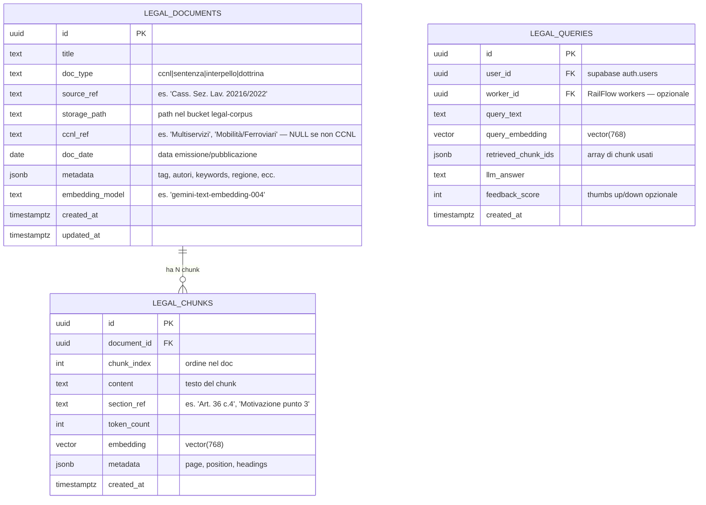
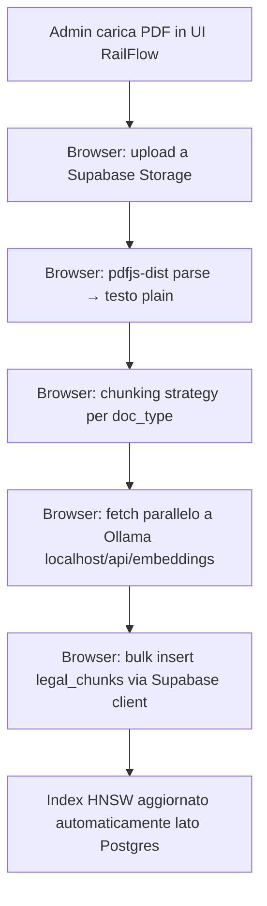
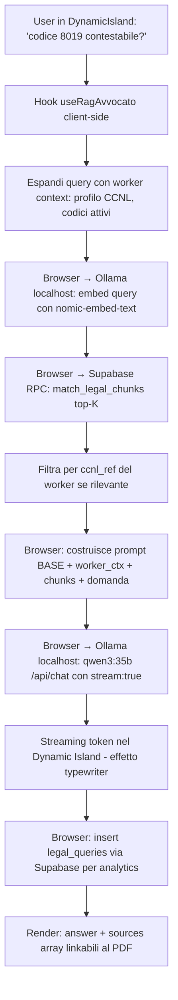

# Proposta Tecnica — RailFlow RAG: "Avvocato Virtuale" (Local-First)

> **Autore**: Claude (Architetto Dati)
> **Data**: 2026-05-16 (rev. 2: stack 100% locale via Ollama)
> **Stato**: Proposta architetturale — in attesa approvazione
> **Scope**: trasformare RailFlow da "estrattore + calcolatore" a "consulente legale assistito" via Retrieval-Augmented Generation su corpus CCNL + sentenze + dottrina, con **inferenza LLM e embeddings 100% locali** (Ollama) e vector store su Supabase.

---

## 1. Contesto e visione

### 1.1 Cosa abbiamo oggi
- **Pipeline OCR**: Gemini estrae codici/importi dalle buste paga (`scan-payslip.ts`)
- **Pipeline verifica**: Gemini verifica matematicamente l'estrazione (`verify-payslip.ts`)
- **Avvocato Virtuale base**: `ask-ai.ts` risponde a domande generiche con un prompt di sistema "Sei un esperto Consulente del Lavoro" — **ma senza alcun contesto documentale reale**. Risponde "a memoria" su quello che Gemini ha appreso durante il training (knowledge cutoff, possibili allucinazioni su CCNL specifici, sentenze inesatte, riferimenti normativi inventati).
- **Storage Supabase**: bucket per i PDF delle buste paga, tabelle `payslip_metadata`, `scan_sessions`, `user_settings`.

### 1.2 Cosa vogliamo
Trasformare `ask-ai.ts` (e potenzialmente `verify-payslip.ts`) da risposta "a memoria" → risposta **fondata su corpus legale verificabile**:
- L'utente chiede: *"Posso contestare la mancata indennità di disagio sul codice 8019 di Clean Service per le festività infrasettimanali?"*
- Il sistema cerca nei documenti rilevanti (CCNL Multiservizi art. X, Cassazione 20216/2022, sentenza Tribunale Roma 2023 sul tema, eventuale interpello ministeriale)
- Costruisce un **contesto fattuale** con i 3-5 estratti più rilevanti
- Gemini risponde **citando gli estratti** con riferimento puntuale (es. "secondo CCNL Multiservizi art. 36 comma 4 [chunk #12, pag. 87], il diritto matura...")

### 1.3 Perché RAG e non fine-tuning
- **Aggiornabile**: nuove sentenze, nuovi CCNL, nuovi interpelli arrivano ogni mese → indexable a costo zero, mentre il fine-tune richiede rebuild
- **Verificabile**: la risposta può citare la fonte con paragrafo specifico → l'utente avvocato può aprire il PDF originale al punto giusto
- **Niente allucinazioni inventate**: il modello risponde sui chunk forniti, non su pattern memorizzati durante il training
- **Costo basso**: $0 per training, solo costi di inferenza standard
- **Privacy**: i documenti restano sul nostro DB Supabase, niente upload a terze parti per training

### 1.4 Cosa NON è in scope di questa proposta
- Scrapers automatici per sentenze (es. download da DeJure / Italgiure) → manuale per ora
- Fine-tuning di Gemini su corpus proprietario
- Multi-tenancy per studi legali esterni
- UI di gestione documenti (admin panel) → sarà fase 2/3

---

## 2. Scelte di stack — decisioni motivate (REV. 2: LOCAL-FIRST)

### 2.0 Vincolo architetturale critico (NUOVO)

**Le Netlify Functions girano in cloud → NON possono raggiungere `http://localhost:11434` della macchina dell'utente.** Questo cambia radicalmente la topologia rispetto alla rev. 1:

| Componente | Rev. 1 (Cloud) | Rev. 2 (Local-First) |
|------------|----------------|----------------------|
| Vector DB | Supabase pgvector | **Invariato** — Supabase pgvector |
| Storage PDF | Supabase Storage bucket | **Invariato** |
| Embeddings | Gemini API (cloud) | **Ollama localhost:11434** (browser → localhost) |
| LLM generazione | Gemini Pro (cloud, via Netlify Function) | **Ollama localhost:11434** (browser → localhost) |
| Dove gira la logica RAG | Netlify Functions (server-side) | **Browser client-side** + RPC SQL su Supabase |

**Tre opzioni per "dove gira la logica RAG"**:

| Opzione | Descrizione | Pro | Contro | Verdetto |
|---------|-------------|-----|--------|----------|
| **A) Client-side direct** ✅ | Il browser di RailFlow fa fetch diretti a `http://localhost:11434` (Ollama) e RPC SQL a Supabase. Nessun backend intermedio. | Setup minimale, zero infra extra, vera privacy-first (i chunk + le query non lasciano mai la macchina locale tranne per andare a Supabase) | Funziona solo se l'utente RailFlow è anche l'host di Ollama (mono-utente o team locale). CORS da gestire. | **Scelto per MVP** — coerente con privacy-first dichiarato |
| B) Backend Node locale | Server Express/Fastify in locale (es. `localhost:3001`) accanto al frontend, fa da proxy a Ollama | Maggiore controllo (logging, retry, multi-tenant locale) | Stack in più da mantenere, processo extra che l'utente deve avviare | Phase 2 se serve |
| C) Tunnel pubblico (ngrok/cloudflared) | Espone Ollama su URL pubblico, Netlify Function lo chiama | Riutilizza pattern Netlify esistente | Vanifica privacy-first (traffic via tunnel third-party), dipendenza da servizio esterno, latenza | **Scartato** — contraddice direttiva privacy |

**Conseguenza Opzione A**: tutta la pipeline RAG (embedding query, similarity search, prompt building, generazione) **vive nel browser TypeScript**, niente nuove Netlify Functions per il RAG. Le funzioni cloud esistenti (`scan-payslip`, `verify-payslip`, `ask-ai`) restano invariate per ora; `ask-ai.ts` cloud diventerà gradualmente obsoleto sostituito da `useRagAvvocato()` hook client-side.

**CORS**: Ollama serve CORS lasco di default per `localhost`. Se il browser blocca, l'utente avvierà Ollama con env `OLLAMA_ORIGINS=*` (o whitelist del dominio RailFlow se deployato). Vedi Phase 1 plan per dettaglio.

### 2.1 Vector store: pgvector su Supabase (invariato)

**Decisione**: pgvector (estensione Postgres ufficiale Supabase). **Nessun cambio rispetto a rev. 1**.

Motivazioni invariate:
- Stack Supabase già attivo, single DB (no sync)
- SQL join con tabelle esistenti (`workers`, `payslip_metadata`)
- RLS gratis, backup/PITR già coperti
- Corpus iniziale stimato < 50k chunks → ampiamente sotto i limiti pgvector
- Versione Supabase: pgvector 0.7+ → indice **HNSW** (scelto su IVFFlat per il nostro size)

Note: il vector store rimane in cloud Supabase perché contiene **solo testi pubblici** (CCNL, sentenze, dottrina già pubblicati) e i loro embeddings. Niente PII utente. La privacy-first si applica a **query e risposte** (che restano locali tramite Ollama), non al corpus legale di pubblico dominio.

### 2.2 Embedding model — LOCALE via Ollama

**Decisione**: **`nomic-embed-text`** servito via Ollama (768 dim), con `mxbai-embed-large` (1024 dim) come fallback se la qualità non basta.

| Modello Ollama | Dim | Size | Pro | Contro |
|----------------|-----|------|-----|--------|
| **`nomic-embed-text`** ✅ | 768 | ~270 MB | Coincide con `vector(768)` già nello schema (zero cambio DDL); ottima qualità multilingual; veloce su CPU; benchmark MTEB competitivo | Italiano legale specialistico è una nicchia → da validare su query reali |
| `mxbai-embed-large` | 1024 | ~670 MB | Più qualità su domini tecnici, top performer MTEB | Richiede `vector(1024)` nello schema → cambio DDL; più lento |
| `bge-m3` | 1024 | ~1.2 GB | Multilingual ottimo, hybrid dense+sparse | Più pesante, richiede vector(1024) |
| `snowflake-arctic-embed` | 1024 | ~670 MB | Buon italiano | Cambio DDL |

**Razionale per `nomic-embed-text`**:
1. **768 dim** = schema esistente (`vector(768)` già nel DDL §3.2) → zero modifiche tabella
2. **Velocità**: ~50ms per chunk su CPU moderna, ~10ms con GPU → ingestion 10.000 chunks in pochi minuti (vs ore con throttling Gemini cloud)
3. **Privacy assoluta**: il testo delle sentenze non lascia mai la macchina dell'utente durante embedding
4. **Costo**: $0
5. **Reversibilità**: cambiare a `mxbai-embed-large` richiede ALTER COLUMN sul vector → fattibile con uno script di reindex (script descritto in `rag-phase-1-plan.md`)

**Endpoint Ollama**:
```
POST http://localhost:11434/api/embeddings
{ "model": "nomic-embed-text", "prompt": "testo del chunk" }
→ { "embedding": [0.123, -0.456, ..., 0.789] }  // 768 numeri
```

### 2.3 LLM di generazione — LOCALE via Ollama

**Decisione**: **`qwen3:35b`** (Qwen 3 / variante 35B parametri) servito da Ollama, come specificato dalla direttiva utente.

**Hardware richiesto** (per riferimento — è hardware dell'utente):
- 35B parametri quantizzati Q4 ≈ ~20-22 GB VRAM/RAM
- Setup minimo: Mac M3 Max 64GB unified memory, oppure PC con GPU 24GB+ (RTX 4090 / A6000)
- Throughput stimato: ~15-25 token/sec su Mac M3 Max, ~40-60 token/sec su GPU dedicata
- Risposta media RAG (500 token output) ≈ 10-30 secondi → accettabile per use case "chiedi al consulente"

**Endpoint Ollama**:
```
POST http://localhost:11434/api/chat
{
  "model": "qwen3:35b",
  "messages": [
    {"role": "system", "content": "<BASE_PROMPT + CONTESTO + FONTI>"},
    {"role": "user", "content": "<domanda utente>"}
  ],
  "options": { "temperature": 0.2 },
  "stream": false  // oppure true per streaming token-by-token nel Dynamic Island
}
→ { "message": { "content": "..." } }
```

**Streaming**: Ollama supporta `stream: true` (chunked NDJSON response). Il Dynamic Island già gestisce risposte progressive → integrazione naturale per UX "typewriter".

**Fallback graceful**: se Ollama è offline (utente non l'ha avviato), la UI deve degradare elegantemente con messaggio chiaro ("Avvia Ollama in locale per usare l'Avvocato Virtuale") invece di errore criptico. Vedi §8 rischi.

### 2.4 Chunking strategy

**Decisione**: strategia ibrida per tipo di documento, con metadata strutturato.

| Tipo documento | Chunking | Size target | Overlap | Razionale |
|----------------|----------|-------------|---------|-----------|
| **CCNL** (articoli numerati) | Per-articolo + sub-split se >1500 token | 800-1500 tok | 100 tok | L'articolo è l'unità semantica naturale; la query "art. 36 CCNL Multiservizi" deve atterrare sul singolo articolo |
| **Sentenze** (Cassazione, Tribunale) | Sliding window su paragrafi | 500-800 tok | 150 tok | Le sentenze hanno motivazioni lunghe, serve overlap per non spezzare il ragionamento giuridico |
| **Interpelli / circolari** | Per-sezione | 500-1000 tok | 100 tok | Documenti generalmente più brevi e topici |
| **Dottrina / manuali** | Per-paragrafo o sezione | 500-1200 tok | 100 tok | Bilanciamento tra granularità e contesto |

**Embedding model token limit**:
- `nomic-embed-text`: 8192 token input → ampiamente sufficiente per qualsiasi chunk
- Chunk grossi (>1500 token) sacrificano la specificità del retrieval; chunk troppo piccoli (<300 token) perdono contesto

**Tooling**:
- Parser PDF: `pdf.js` (web-native, gira nel browser → coerente con architettura client-side) oppure `pdfjs-dist` package
- Per CCNL strutturati: regex-based splitter per identificare "Art. NN" come boundary
- Per sentenze: split su `\n\n` (paragrafi) + window sliding
- Conteggio token: stima approssimativa via `text.length / 4` (rule of thumb italiano)

### 2.5 Retrieval strategy

**Decisione Phase 1**: pure vector similarity (cosine distance) con top-K=5.

**Decisione Phase 2** (post-MVP, se servisse): hybrid search vector + BM25 (Postgres ha full-text search nativo `tsvector`/`tsquery` → si può fare hybrid senza terze parti) + reranking via cross-encoder.

---

## 3. Schema database — proposta DDL

### 3.1 Diagramma ER



### 3.2 DDL proposto (commento, non da eseguire)

```sql
-- Extension (one-shot via Supabase Dashboard o migration)
CREATE EXTENSION IF NOT EXISTS vector;

-- Tabella 1: documenti legali (1 record per documento sorgente)
CREATE TABLE legal_documents (
  id              uuid PRIMARY KEY DEFAULT gen_random_uuid(),
  title           text NOT NULL,
  doc_type        text NOT NULL CHECK (doc_type IN ('ccnl', 'sentenza', 'interpello', 'circolare', 'dottrina', 'altro')),
  source_ref      text,                       -- es. 'Cass. Sez. Lav. 20216/2022'
  storage_path    text,                       -- path nel bucket Supabase 'legal-corpus/...'
  ccnl_ref        text,                       -- 'Multiservizi', 'Mobilità/Ferroviari', NULL
  doc_date        date,                       -- data pubblicazione/sentenza
  metadata        jsonb DEFAULT '{}',
  embedding_model text NOT NULL,              -- traccia versione del modello usato → per reindex futuro
  created_at      timestamptz DEFAULT now(),
  updated_at      timestamptz DEFAULT now()
);

CREATE INDEX idx_legal_documents_doc_type ON legal_documents (doc_type);
CREATE INDEX idx_legal_documents_ccnl_ref ON legal_documents (ccnl_ref) WHERE ccnl_ref IS NOT NULL;
CREATE INDEX idx_legal_documents_metadata ON legal_documents USING GIN (metadata);

-- Tabella 2: chunk con embeddings (1 record per chunk → N chunks per doc)
CREATE TABLE legal_chunks (
  id              uuid PRIMARY KEY DEFAULT gen_random_uuid(),
  document_id     uuid NOT NULL REFERENCES legal_documents(id) ON DELETE CASCADE,
  chunk_index     int NOT NULL,
  content         text NOT NULL,
  section_ref     text,                       -- es. 'Art. 36 c.4', 'pag. 7 par. 3'
  token_count     int,
  embedding       vector(768) NOT NULL,       -- DIMENSIONE FISSA = modello scelto
  metadata        jsonb DEFAULT '{}',
  created_at      timestamptz DEFAULT now(),
  UNIQUE (document_id, chunk_index)
);

-- Indice HNSW per cosine distance (raccomandato pgvector 0.5+)
CREATE INDEX idx_legal_chunks_embedding_hnsw
  ON legal_chunks
  USING hnsw (embedding vector_cosine_ops)
  WITH (m = 16, ef_construction = 64);

-- Indice di filtraggio pre-vector (per restringere il corpus a CCNL specifico prima di calcolare la distanza)
CREATE INDEX idx_legal_chunks_document_id ON legal_chunks (document_id);

-- Tabella 3: log query + risposte (per analytics, feedback, audit)
CREATE TABLE legal_queries (
  id                   uuid PRIMARY KEY DEFAULT gen_random_uuid(),
  user_id              uuid REFERENCES auth.users(id) ON DELETE SET NULL,
  worker_id            uuid REFERENCES workers(id) ON DELETE SET NULL,  -- opzionale: query nel contesto di un lavoratore
  query_text           text NOT NULL,
  query_embedding      vector(768),            -- opzionale, utile per "domande simili poste in passato"
  retrieved_chunk_ids  uuid[],                 -- array degli id chunk usati come contesto
  llm_answer           text,
  feedback_score       smallint,               -- -1, 0, +1 (thumbs)
  created_at           timestamptz DEFAULT now()
);

CREATE INDEX idx_legal_queries_user_id ON legal_queries (user_id);
CREATE INDEX idx_legal_queries_created_at ON legal_queries (created_at DESC);
```

### 3.3 Versionamento embedding model

Il campo `legal_documents.embedding_model` è **critico**: se in Phase 2 cambiamo modello (es. da Gemini 004 a OpenAI 3-small), dobbiamo:
1. Filtrare i documenti dove `embedding_model != 'nuovo-modello'`
2. Reindicizzare i loro chunks (job batch)
3. Aggiornare il flag

In alternativa più radicale: **mantenere due tabelle chunks parallele** (`legal_chunks_v1`, `legal_chunks_v2`) per A/B test in produzione. Per ora opto per la prima (più semplice).

### 3.4 Row Level Security (RLS)

Pattern Supabase:
- **`legal_documents` SELECT**: tutti gli utenti autenticati (corpus condiviso)
- **`legal_chunks` SELECT**: idem
- **`legal_documents` / `legal_chunks` INSERT/UPDATE/DELETE**: solo admin (claim `role = 'admin'` nel JWT, o tabella `admin_users` allowlist)
- **`legal_queries` SELECT/INSERT**: utente vede solo le proprie (`auth.uid() = user_id`)

Esempio policy (commento):
```sql
ALTER TABLE legal_documents ENABLE ROW LEVEL SECURITY;
CREATE POLICY "read_all_authenticated" ON legal_documents
  FOR SELECT TO authenticated USING (true);
CREATE POLICY "admin_write" ON legal_documents
  FOR ALL TO authenticated
  USING (auth.jwt() ->> 'role' = 'admin')
  WITH CHECK (auth.jwt() ->> 'role' = 'admin');
```

### 3.5 Storage bucket dedicato

Creare bucket Supabase Storage **`legal-corpus`** (privato), separato dal bucket buste paga:
- I PDF sorgente vengono caricati lì (`legal-corpus/ccnl/multiservizi-2024.pdf`, `legal-corpus/sentenze/cass-20216-2022.pdf`)
- `legal_documents.storage_path` punta al file → la UI può linkare il PDF originale per ispezione manuale ("apri il documento sorgente")
- Permessi: read pubblico per authenticated, write solo admin

---

## 4. Pipeline ingestion (Documento → DB) — CLIENT-SIDE

### 4.1 Flusso end-to-end



**Cambio rispetto a rev. 1**: niente Netlify Function `ingest-legal-doc`. La pipeline gira **interamente nel browser** (compresa la parsificazione PDF). Tutto avviene sulla macchina dell'utente — i bytes del PDF e il testo dei chunk non passano mai da un server cloud (tranne Supabase per lo storage finale).

### 4.2 Step dettagliati

**Step 1 — Upload & metadata**
- UI admin RailFlow: form drag-and-drop PDF + campi `title`, `doc_type`, `source_ref`, `ccnl_ref`, `doc_date`
- File caricato in `legal-corpus/<doc_type>/<slug>.pdf` (Supabase Storage, bucket privato auth-only)
- Inserito record in `legal_documents` con `embedding_model = 'nomic-embed-text'`

**Step 2 — Parse PDF (browser-side)**
- `pdfjs-dist` legge il PDF appena caricato (oppure lo scarica dallo Storage se rilanciato successivamente)
- Estrae testo plain pagina per pagina
- Mantiene metadata per-pagina: `{ page_number, text }` → utile per `section_ref`
- Per PDF scansionati senza layer testo: bypass per ora (segnaliamo all'utente "PDF scansionato — eseguire OCR manualmente prima dell'upload"). OCR locale via Tesseract.js è opzione Phase 2.

**Step 3 — Chunking**
- Applica strategia in base a `doc_type` (vedi §2.4)
- Output: array di `{ content, section_ref, token_count, chunk_index }`
- Tutto in memoria browser, zero round-trip

**Step 4 — Embedding (LOCALE, parallelo, no throttling)**
- Per ogni chunk: `fetch('http://localhost:11434/api/embeddings', { model: 'nomic-embed-text', prompt: chunk.content })`
- **Niente throttling**: gira in locale, l'unico vincolo è la RAM/CPU della macchina dell'utente
- **Concorrenza**: `Promise.all` su batch di N=4-8 in parallelo (Ollama gestisce code interne, ma evitiamo di saturarne la queue → N parallele bilancia velocità e stabilità)
- **Idempotenza**: prima della pipeline, query `SELECT chunk_index FROM legal_chunks WHERE document_id = $1` → skip chunks già presenti (utile per retry su errori parziali, es. utente chiude il browser a metà)
- Ottenuto per ogni chunk: `embedding: number[768]`

**Step 5 — Bulk insert**
- `supabase.from('legal_chunks').insert(chunks_array)` in batch da ~50 per non saturare il payload HTTP (1 chunk ~ 768*8 byte = 6KB con metadata, 50 chunks = 300KB → safe)
- L'indice HNSW si aggiorna incrementalmente sul lato Postgres (caratteristica HNSW, niente reindex full)

**Step 6 — Progress feedback**
- UI mostra progress bar: chunks elaborati / totali, ETA stimato
- Sfruttiamo il Dynamic Island esistente (pattern già visto per upload buste paga)
- Notifica completion con summary: `"📚 Documento indicizzato — 87 chunks pronti per la ricerca"`

### 4.3 Performance attese (no throttling)
- Embedding `nomic-embed-text` su CPU moderna: ~50ms/chunk; su GPU Apple Silicon: ~10-20ms/chunk
- Con concorrenza 8: ~10-20 chunks/sec
- **Esempio**: CCNL Multiservizi 200 pagine, ~500 chunks → indicizzazione completa in **30-60 secondi end-to-end** (vs ore di rev. 1 con throttling cloud)
- Bottleneck reale: latenza Supabase per il bulk insert (~200ms/batch) → trascurabile

### 4.4 Edge cases da gestire
- **Ollama offline**: la pipeline rileva subito (`fetch` fallisce sulla prima embed) → blocca con messaggio "Avvia Ollama prima di procedere" + link a docs di setup
- **PDF scansionato**: vedi Step 2
- **CCNL con tabelle complesse**: per ora indicizzate come blob testuale; Phase 2 estrazione strutturata
- **Aggiornamenti documento** (es. CCNL 2025 sostituisce 2024): mantenere entrambi con `doc_date` diverso, taggando il vecchio come "superseded" via metadata. Mai cancellare per audit/storico.
- **CORS**: se Ollama blocca la richiesta dal browser (default è permissivo su localhost ma può variare), avviare con `OLLAMA_ORIGINS='*'` o whitelist domain (`OLLAMA_ORIGINS='http://localhost:5173,https://railflow.netlify.app'`). Documentato in Phase 1 plan.

---

## 5. Pipeline retrieval (Query → Risposta arricchita) — CLIENT-SIDE

### 5.1 Flusso end-to-end



**Cambio rispetto a rev. 1**: niente Netlify Function intermedia. Tutta la pipeline RAG vive in un hook React `useRagAvvocato()` client-side. Browser parla con: (a) Ollama localhost per embed + LLM, (b) Supabase per similarity search e logging.

### 5.2 Step dettagliati

**Step 1 — Query expansion**
- Se l'utente sta visualizzando un worker, includi nel contesto: `profilo` (CCNL), codici delle indennità del CCNL, dati del mese in oggetto
- Esempio query reale: utente scrive "*è dovuto?*" mentre guarda il mese di marzo di un lavoratore Clean Service → l'hook arricchisce a "*è dovuta l'indennità di disagio (codice 8019) per il lavoratore con CCNL Multiservizi per marzo 2024?*"

**Step 2 — Embed query (LOCALE)**
- `POST http://localhost:11434/api/embeddings { model: 'nomic-embed-text', prompt: expanded_query }`
- Stesso modello usato in ingestion → **dimensione e modello DEVONO coincidere** (vincolo invariato)
- Caching opzionale: query identiche entro N minuti riutilizzano l'embedding in memoria React state (chiave `hash(query_text)`)
- Latenza tipica: 50-200ms su CPU, <50ms su GPU

**Step 3 — Similarity search**

```sql
-- Query SQL invocata via supabase.rpc('match_legal_chunks', { ... })
SELECT
  c.id, c.content, c.section_ref,
  d.title, d.source_ref, d.doc_type,
  1 - (c.embedding <=> $1::vector) AS similarity
FROM legal_chunks c
JOIN legal_documents d ON c.document_id = d.id
WHERE
  ($2::text IS NULL OR d.ccnl_ref = $2)  -- pre-filter opzionale
  AND (1 - (c.embedding <=> $1::vector)) > 0.7  -- soglia qualità
ORDER BY c.embedding <=> $1::vector
LIMIT 5;
```

Esposta come Postgres function (RPC) → richiamabile via `supabase.rpc('match_legal_chunks', { query_embedding, ccnl_filter, threshold, k })`. Il pattern RPC è standard Supabase per evitare di esporre SQL crudo dal client.

**Step 4 — Prompt augmentation**
- Costruisce un prompt strutturato:

```text
[BASE_PROMPT — esistente ask-ai.ts]

[CONTESTO LAVORATORE]
- Profilo: Clean Service SRL (CCNL Multiservizi)
- Codice in oggetto: 8019 (LAVORO FESTIVO 35%)
- Mese: marzo 2024
- Importo estratto: € 145.20

[FONTI LEGALI RILEVANTI — non inventare riferimenti diversi]

[1] CCNL Multiservizi — Art. 36 c.4 (titolo doc, source_ref)
    "Il lavoratore impiegato in giornata festiva infrasettimanale ha diritto a..."
    (similarity: 0.89)

[2] Cass. Sez. Lav. 20216/2022 (titolo doc, source_ref)
    "La maggiorazione del 35% spetta in ogni caso di prestazione resa in giorno festivo..."
    (similarity: 0.82)

[3] Interpello Ministero Lavoro 15/2023
    "..."
    (similarity: 0.78)

[ISTRUZIONI]
- Rispondi citando ESPLICITAMENTE le fonti tra [1] [2] [3].
- Se le fonti non bastano per rispondere, dillo apertamente — NON inventare riferimenti.
- Se rilevi che il codice estratto presenta anomalia rispetto al CCNL, segnalala.

[DOMANDA]
{user_question}
```

**Step 5 — Generazione risposta (LOCALE, streaming)**
- `POST http://localhost:11434/api/chat` con `model: 'qwen3:35b'`, `temperature: 0.2`, `stream: true`
- Body: `messages: [{role:'system', content: SYSTEM_PROMPT}, {role:'user', content: USER_PROMPT}]` (vedi prompt template Step 4)
- **Streaming NDJSON**: ogni chunk JSON ricevuto contiene `message.content` parziale → push live nel Dynamic Island per effetto typewriter coerente con UX esistente
- Latenza tipica fino al primo token: 1-3s (model load + prefill); throughput: ~15-25 token/s su Mac M3 Max → risposta ~500 token in 25-40s
- Output finale: text completo + parsing per estrarre `[1] [2] [3]` → mapping a `chunk_id` per UI delle fonti

**Step 6 — Log e analytics**
- Insert in `legal_queries` via Supabase client con: query, embedding, chunk_ids usati, answer, timestamp
- Utile per:
  - Identificare query frequenti non coperte dal corpus (gap analysis → quali documenti caricare)
  - Misurare qualità via feedback thumbs up/down (campo `feedback_score`)
  - Audit legale: chi ha chiesto cosa, su quale corpus, ricevendo quale risposta

### 5.3 Sicurezza prompt injection
- Sanitizzare la query utente prima dell'embed (rimuovere caratteri di controllo)
- Nel prompt finale, **non** lasciare che la query utente sembri parte delle istruzioni di sistema (delimitazione chiara con tag `[DOMANDA] ... [/DOMANDA]`)
- Limitare lunghezza query: max 2000 caratteri (più generoso del rev. 1 perché non c'è costo per-token)
- **Rate limiting non più necessario lato server**: il limite è la velocità di Qwen 3 35b stesso (~1 risposta ogni 30s) → naturale bottleneck protettivo

---

## 6. Roadmap proposta (fasi)

### Phase 1 — MVP (target: 1-2 settimane, accelerato grazie a stack locale)
1. Setup Ollama macchina utente: install + `ollama pull nomic-embed-text` + `ollama pull qwen3:35b`
2. Abilitare pgvector su Supabase (1 click + SQL migration)
3. Creare tabelle `legal_documents`, `legal_chunks`, `legal_queries` + RLS
4. Creare bucket `legal-corpus` Supabase Storage
5. Helper TypeScript client-side `lib/ollama.ts`: wrappers per `/api/embeddings` e `/api/chat`
6. Hook `useRagIngestion()`: pipeline upload + parse + chunk + embed + insert client-side
7. RPC SQL `match_legal_chunks` su Postgres (esposta via `supabase.rpc`)
8. Hook `useRagAvvocato()`: pipeline query + retrieval + prompt + streaming chat
9. **Bootstrap corpus**: indicizzare 5-10 documenti seed (CCNL Multiservizi, CCNL Mobilità RFI, CCNL Ristorazione, Cassazione 20216/2022, qualche sentenza di merito recente)
10. UI: hook integrato nel Dynamic Island Spotlight esistente — gradiente UI "Avvocato attivo" quando Ollama è raggiungibile

**Criterio di successo Phase 1**: 5 query reali di test pongono 5 risposte con citazioni verificabili nei PDF sorgente, con tempo end-to-end < 60s per query.

### Phase 2 — Qualità e attribuzione (target: 1-2 settimane)
1. UI: visualizzare le citazioni nella risposta (es. footer con link "📄 [1] CCNL Multiservizi Art. 36 — apri PDF" → deep-link al PDF nel bucket Supabase)
2. Strategia chunking specifica per doc_type (parser CCNL per-articolo)
3. Feedback UI (thumbs up/down sulla risposta) → popola `feedback_score`
4. Admin panel base: lista documenti, status indicizzazione, possibilità di reindicizzare singoli docs
5. Health check Ollama: badge UI "🟢 Avvocato ON / 🔴 Ollama offline" sempre visibile

### Phase 3 — Avanzato (post-MVP)
1. Hybrid search: BM25 (Postgres tsvector) + vector → reranking → top-K finale
2. Re-ranker via cross-encoder locale (es. `bge-reranker-v2-m3` via Ollama o LM Studio)
3. Multi-hop reasoning: per query complesse, 2-3 round di retrieval (es. prima trova il CCNL articolo, poi trova sentenze sul tema)
4. Integrazione in `verify-payslip.ts`: durante la verifica, se rileva anomalia, allega automaticamente la citation legale che la fonda (richiede però refactor: verify-payslip oggi è cloud Gemini → o lo lasciamo cloud + chiamate ibride, o lo riportiamo client-side per essere coerenti)
5. OCR locale (Tesseract.js) per PDF scansionati in ingestion

---

## 7. Costi stimati (MVP) — LOCAL-FIRST

Assunzioni: 200 documenti seed, media 50 chunks/doc → ~10.000 chunks; 500 query/mese.

| Voce | Costo stimato |
|------|---------------|
| pgvector storage (Supabase) | Trascurabile (10k chunks × 768 float = ~30 MB) — incluso nel piano Supabase corrente |
| Indexing 10k embeddings (Ollama locale) | **$0** (elettricità trascurabile) |
| Query embedding (500 query/mese) | **$0** |
| LLM generation Qwen 3 35b (500 query/mese) | **$0** (elettricità trascurabile, ~kWh stimato in giorni di uso) |
| Storage PDF (200 docs × 2MB = 400 MB) | Incluso piano Supabase corrente |
| **Totale incrementale mensile** | **$0** (oltre Supabase già pagato) |

**Costo una tantum di setup**:
- Hardware Mac M3 Max 64GB / PC con GPU 24GB: prerequisito (assumiamo già presente)
- Download modelli Ollama: ~25 GB di spazio disco (Qwen 3 35b ~22GB + nomic-embed-text ~270MB + buffer)
- Tempo setup: 30 minuti (install Ollama + pull modelli)

**Trade-off**:
- 💚 Costi LLM/embeddings azzerati a regime
- 💚 Privacy: query, chunks e risposte non lasciano la macchina
- 🟡 Performance variabile per macchina utente: query latency 30-60s su M3 Max, fino a 2-3 min su CPU-only
- 🔴 Servizio degradato se utente non ha avviato Ollama (UX da gestire — vedi §8)
- 🔴 Distribuzione multi-utente complessa: ogni utente deve avere il proprio Ollama setup (per ora accettabile, è single-user / team interno)

---

## 8. Rischi e mitigazioni (REV. 2 — LOCAL-FIRST)

| Rischio | Probabilità | Impatto | Mitigazione |
|---------|-------------|---------|-------------|
| **Ollama offline** (utente non l'ha avviato) | **Alta** | **Alto** | Health check su mount del Dynamic Island: ping `GET http://localhost:11434/api/tags`. Se KO → UI degradata con badge rosso "Avvia Ollama" + istruzioni step-by-step inline. Niente errore criptico. |
| **CORS bloccato dal browser** verso localhost | Media | Alto | Documentazione setup: `OLLAMA_ORIGINS='*'` (dev) o whitelist domain (prod). Test al primo avvio: se fetch fallisce con CORS, mostra istruzione esatta da copiare |
| **Hardware utente insufficiente** (RAM/VRAM per 35b) | Media | Alto | Fallback automatico a `qwen3:14b` o `qwen3:8b` se 35b OOM. Helper di startup detecta e suggerisce il modello max supportato |
| **Modello Qwen 3.6 35b non disponibile** su Ollama | Bassa | Medio | Verificare alla Phase 1 il nome esatto del tag Ollama (es. `qwen3:35b` vs `qwen3.5:35b`); doc ufficiale https://ollama.com/library/qwen3 |
| **Qualità retrieval scarsa** (top-5 non rilevante) | Media | Alto | Phase 2: hybrid search + reranking; nel frattempo, soglia similarity (`> 0.7`) + chunking accurato |
| **Allucinazioni residue** ("inventa" citazione) | Media | Alto | Prompt esplicito "non inventare riferimenti diversi"; UI mostra le citazioni con link al PDF per verifica visiva immediata; `temperature: 0.2` per minimizzare creatività |
| **Cambio embedding model** in futuro | Bassa | Medio | Schema versionato (`embedding_model` field) → reindex job pronto (è veloce: 10k chunks in pochi minuti localmente) |
| **Corpus legale obsoleto** (CCNL scaduto) | Media | Alto | Campo `doc_date` + UI admin che evidenzia documenti vecchi; metadata tag `superseded_by` |
| **Distribuzione multi-utente** (team) | Bassa MVP / Alta dopo | Alto | MVP: single user (sviluppatore). Post-MVP: doc setup per team interno, oppure considerare backend Node locale condiviso in LAN |
| **Performance percepita lenta** (30-60s per risposta) | Alta | Medio | UX: streaming token-by-token nel Dynamic Island + skeleton loading + ETA visibile; coda dei messaggi in attesa |

---

## 9. Decisioni richieste prima di iniziare

Per validare il piano e procedere con la Phase 1, servono tue scelte su:

1. ~~**Embedding model**~~ → **Risolto in rev. 2**: `nomic-embed-text` via Ollama (768 dim, schema invariato).
2. **Corpus seed**: hai già documenti PDF da indicizzare (CCNL Multiservizi/Mobilità/Ristorazione, sentenze chiave) oppure dobbiamo procurarceli? Quali sono i 5-10 documenti prioritari per il MVP?
3. **Admin role**: come gestiamo l'identificazione admin per RLS? JWT claim custom Supabase, tabella `admin_users` allowlist, o per la Phase 1 accettiamo che gli insert avvengano solo via service_role key (no UI admin)?
4. **Where to surface the RAG**: la prima esperienza utente del RAG deve essere in (a) Dynamic Island Spotlight, (b) un nuovo "Avvocato Virtuale" modale dedicato, (c) integrato in `verify-payslip` (citation automatica accanto alle discrepancies), oppure (d) tutto e tre? La scelta cambia priorità UI in Phase 1.
5. ~~**Budget mensile target**~~ → **Risolto in rev. 2**: $0 incrementale grazie a stack locale.
6. **NUOVO — Tag esatto del modello Qwen su Ollama**: hai già `ollama pull qwen3:35b` funzionante, oppure dobbiamo verificare il tag corretto (es. `qwen3.5:35b`, `qwen2.5:32b-instruct`)? Da chiarire prima dell'implementazione.
7. **NUOVO — Topologia distribuzione**: confermi single-user (solo tu sviluppatore) per Phase 1? O dobbiamo già pensare a team interno con Ollama condiviso su una macchina LAN dedicata?

---

## 10. Prossimi passi se approvato

1. Sessione di review congiunta del documento (30 min) con eventuali revisioni
2. Risposta alle 4 domande aperte di §9 (2, 3, 4, 6, 7)
3. Apertura branch `feat/rag-mvp`
4. Implementazione Phase 1 (target 1-2 settimane di lavoro effettivo, accelerato da assenza vincoli cloud)
5. Test sui 5-10 documenti seed → demo interna

Il file operativo `tasks/rag-phase-1-plan.md` (in arrivo subito) contiene il dettaglio delle migration SQL, signature degli hook React/utility client-side, comandi di setup Ollama, e step di implementazione ordinati. Questo documento attuale resta come riferimento architetturale di lungo periodo.
